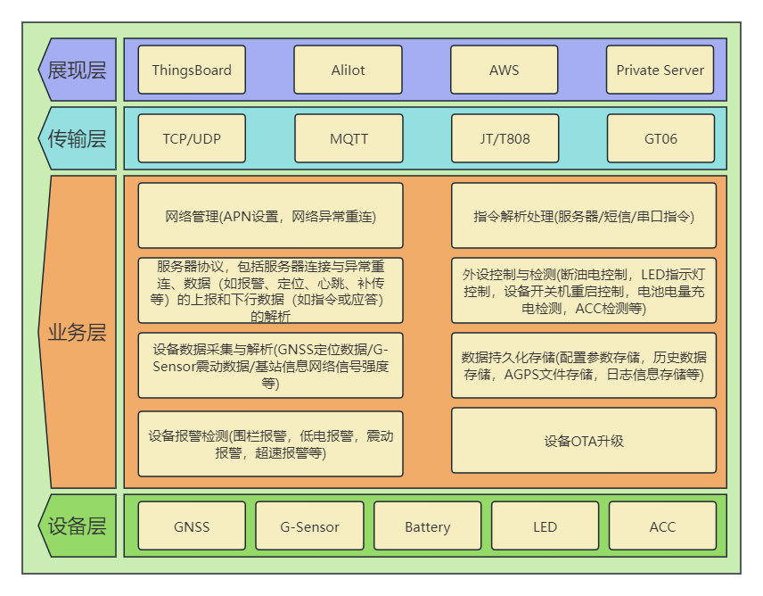
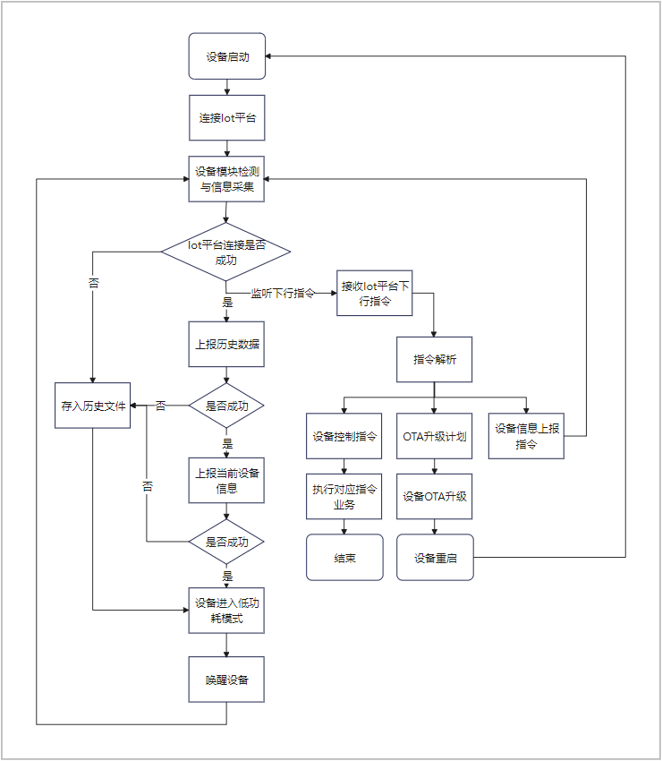
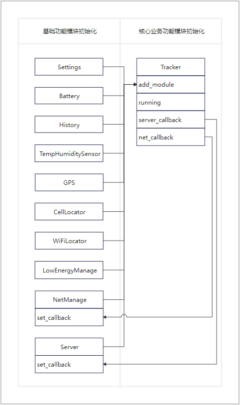

**中文** | [English](../EN/Tracker%20solution%20design%20guide.md) | 

# 定位器方案设计指导

## 引言

本文档主要描述移远通信QuecPython定位器的设计框架, 包含软硬件系统框架、关键组件功能描述、系统初始化流程和业务流程的介绍以及功能示例, 方便用户快速了解QuecPython定位器的整体架构与功能。

## 功能简介

智能定位器方案中的软件功能介绍如下图所示, 方案根据定位器实际业务进行功能拆分, 模块化开发实现。


- 传输协议解析
    + 阿里Iot平台连接与数据交互
    + ThingsBoard平台连接与数据交互
    + GT06协议
    + JT/T808协议
- 网络管理
    + MQTT协议(阿里Iot/ThingsBoard/其他平台)
    + TCP/UDP协议(GT06/JTT808协议)
    + APN设置(用于注网拨号)
    + LTE NET(4G注网拨号)
- 外设管理
    + GNSS定位数据的读取, 使能, AGPS注入等
    + G-Sensor传感器数据读取
    + Charge IC充电管理, 获取设备充电状态
    + Battery电池管理, 读取电池电压, 换算电量
    + LED指示灯
- 数据存储
    + 系统配置参数存储
    + 定位数据补传存储
    + AGPS下载存储
    + 日志信息存储
- 设备升级
    + OTA升级
- 业务功能管理
    + 网络与IoT 平台的连接与重连
    + 设备数据采集与上报
    + 报警检测与上报
    + IoT 平台下行指令处理
    + 设备低功耗休眠

## 数据交互流程

模组、IoT 平台之间数据交互流程如下图介绍:


流程描述：

1. 手机APP发送指令到IoT 平台, 服务端通过TCP/UDP/MQTT协议下发指令数据到模组端接收, 模组进行解析处理;
2. 模组通过TCP/UDP/MQTT协议上报数据到IoT 平台, IoT 平台进行处理, 同步显示到手机端

## 软件框架

### 设计思想与模式

- 本系统采用监听者模式设计，通过回调函数进行消息的传递事件的监听
- 软件根据定位器业务需求对其功能进行拆分, 主要分模块来实现, 每个部分独立开发实现, 相互之间减少依赖, 可独立调试运行, 达到解耦合的效果;
- 功能之间的事件交互都通过回调函数来完成, 所有的业务功能处理全部在`Tracker`类中进行处理, 如下行的指令处理, 报警检测, 数据采集与上报, 设备的控制等。


1. 所有的功能模块通过`Tracker.add_module`注册到`Tracker`类中进行控制
2. Server模块(IoT 平台交互模块)通过回调将服务型下行的数据传递到`Tracker.server_callback`中进行处理
3. NetManage模块通过回调将网络断开连接事件传递到`Tracker.net_callback`中进行处理

### 软件架构图

软件系统框架介绍描述如下:

- 展现层, 对接不同的 IoT 平台
- 传输层, 使用不同的协议进行交互
- 业务层, 主要用于采集设备数据, 控制设备模块, 接收处理IoT 平台下行指令, 数据的整合上报
- 设备层,  主要是定位数据的获取与解析, 传感器数据的读取, 电池管理, 历史数据存储等功能, 设备数据的信息的采集与设备功能设置, 如设备的版本信息, IMEI号, APN设置, 网络拨号, 设备低功耗等



## 功能组件介绍

### 核心业务模块(Tracker)

1. 功能描述：

实现核心业务逻辑, 与服务端的数据交互解析, 设备模块的控制, 所有功能以事件的形式, 传入业务事件消息队列子线程中处理。

2. 实现原理：

- 通过注册功能模块, 获取各个功能模块的数据, 如定位信息, 电池信息, 传感器信息等；

```python
class Tracker:
    ...

    def add_module(self, module):
        # 将各个功能模块注册到Tracker类中，在Tracker类中进行控制
        if isinstance(module, AliIot):
            self.__server = module
        elif isinstance(module, AliIotOTA):
            self.__server_ota = module
        elif isinstance(module, Battery):
            self.__battery = module
        elif isinstance(module, History):
            self.__history = module
        elif isinstance(module, GNSS):
            self.__gnss = module
        elif isinstance(module, CellLocator):
            self.__cell = module
        elif isinstance(module, WiFiLocator):
            self.__wifi = module
        elif isinstance(module, NMEAParse):
            self.__nmea_parse = module
        elif isinstance(module, CoordinateSystemConvert):
            self.__csc = module
        elif isinstance(module, NetManage):
            self.__net_manage = module
        elif isinstance(module, PowerManage):
            self.__pm = module
        elif isinstance(module, TempHumiditySensor):
            self.__temp_sensor = module
        elif isinstance(module, Settings):
            self.__settings = module
        else:
            return False
        return True

    def running(self, args=None):
        if self.__running_tag == 1:
            return
        self.__running_tag = 1
        # 禁用设备休眠
        self.__pm.autosleep(0)
        self.__pm.set_psm(mode=0)
        # 启动业务事件消息队列监听子线程
        self.__business_start()
        # 发送OTA版本刷新指令到事件队列中进行执行
        self.__business_queue.put((0, "ota_refresh"))
        # 发送上报定位数据事件(包含网络的连接，设备数据的采集，设备数据的上报)
        self.__business_queue.put((0, "loc_report"))
        # 发送OTA升级查询指令事件
        self.__business_queue.put((0, "check_ota"))
        # 发送设备休眠事件
        self.__business_queue.put((0, "into_sleep"))
        self.__running_tag = 0
```

- 通过回调监听服务端下发的指令消息, 进行业务处理；

```python
class  Tracker:
    ...

    def server_callback(self, args):
        # 服务端下行消息传入业务事件消息队列中进行处理
        self.__business_queue.put((1, args))
```

```python
class Tracker:
    ...

    def __business_running(self):
        while True:
            data = self.__business_queue.get()
            with self.__business_lock:
                self.__business_tag = 1
                ...
                # 处理IoT 平台下行指令功能
                if data[0] == 1:
                    self.__server_option(*data[1])
                self.__business_tag = 0
```

```python
class Tracker:
    ...

    def __server_option(self, topic, data):
        if topic.endswith("/property/set"):
            # 处理属性设置的下行消息
            self.__server_property_set(data)
        elif topic.find("/rrpc/request/") != -1:
            # 处理透传数据的下行消息
            msg_id = topic.split("/")[-1]
            self.__server_rrpc_response(msg_id, data)
        elif topic.find("/thing/service/") != -1:
            # 处理服务数据的下行消息
            service = topic.split("/")[-1]
            self.__server_service_response(service, data)
        elif topic.startswith("/ota/device/upgrade/") or topic.endswith("/ota/firmware/get_reply"):
            # 处理OTA升级的下行消息
            user_cfg = self.__settings.read("user")
            if self.__server_ota_flag == 0:
                if user_cfg["sw_ota"] == 1:
                    self.__server_ota_flag = 1
                    if user_cfg["sw_ota_auto_upgrade"] == 1 or user_cfg["user_ota_action"] == 1:
                        # 满足OTA升级条件，执行OTA升级流程
                        self.__server_ota_process(data)
                    else:
                        self.__server_ota_flag = 0
                        self.__server_ota.set_ota_data(data["data"])
                        ota_info = self.__server_ota.get_ota_info()
                        ota_info["ota_status"] = 1
                        self.__server_ota_state_save(**ota_info)
                else:
                    module = data.get("data", {}).get("module")
                    self.__server.ota_device_progress(-1, "Device is not alowed ota.", module)
```

- 通过RTC回调唤醒操作, 唤醒设备休眠, 进行业务数据上报.

```python
class Tracker:
    ...

    def __into_sleep(self):
        while True:
            if self.__business_queue.size() == 0 and self.__business_tag == 0:
                break
            utime.sleep_ms(500)
        user_cfg = self.__settings.read("user")
        # 根据休眠时长自动调整休眠模式，autosleep或者psm
        if user_cfg["work_cycle_period"] < user_cfg["work_mode_timeline"]:
            self.__pm.autosleep(1)
        else:
            self.__pm.set_psm(mode=1, tau=user_cfg["work_cycle_period"], act=5)
        # 启动RTC定时唤醒设备
        self.__set_rtc(user_cfg["work_cycle_period"], self.running)

    def __set_rtc(self, period, callback):
        # 设置RTC唤醒时钟，唤醒设备
        self.__business_rtc.enable_alarm(0)
        if callback and callable(callback):
            self.__business_rtc.register_callback(callback)
        atime = utime.localtime(utime.mktime(utime.localtime()) + period)
        alarm_time = (atime[0], atime[1], atime[2], atime[6], atime[3], atime[4], atime[5], 0)
        _res = self.__business_rtc.set_alarm(alarm_time)
        log.debug("alarm_time: %s, set_alarm res %s." % (str(alarm_time), _res))
        return self.__business_rtc.enable_alarm(1) if _res == 0 else -1
```

3. 注册功能模块与回调函数配置

```python
def main():
    # 初始化网络功能模块
    net_manage = NetManage(PROJECT_NAME, PROJECT_VERSION)
    # 初始化配置参数功能模块
    settings = Settings()
    # 初始化电池检测功能模块
    battery = Battery()
    # 初始化历史数据功能模块
    history = History()
    # 初始化IoT 平台(阿里Iot)功能模块
    server_cfg = settings.read("server")
    server = AliIot(**server_cfg)
    # 初始化IoT 平台(阿里Iot)OTA功能模块
    server_ota = AliIotOTA(PROJECT_NAME, FIRMWARE_NAME)
    server_ota.set_server(server)
    # 初始化低功耗功能模块
    power_manage = PowerManage()
    # 初始化温湿度传感器功能模块
    temp_sensor = TempHumiditySensor(i2cn=I2C.I2C1, mode=I2C.FAST_MODE)
    loc_cfg = settings.read("loc")
    # 初始化GNSS定位功能模块
    gnss = GNSS(**loc_cfg["gps_cfg"])
    # 初始化基站定位功能模块
    cell = CellLocator(**loc_cfg["cell_cfg"])
    # 初始化Wifi定位功能模块
    wifi = WiFiLocator(**loc_cfg["wifi_cfg"])
    # 初始化GNSS定位数据解析功能模块
    nmea_parse = NMEAParse()
    # 初始化WGS84与GCJ02坐标系转换功能模块
    cyc = CoordinateSystemConvert()

    # 初始化Tracker业务功能模块
    tracker = Tracker()
    # 将基础功能模块注册到Tracker类中进行控制
    tracker.add_module(settings)
    tracker.add_module(battery)
    tracker.add_module(history)
    tracker.add_module(net_manage)
    tracker.add_module(server)
    tracker.add_module(server_ota)
    tracker.add_module(power_manage)
    tracker.add_module(temp_sensor)
    tracker.add_module(gnss)
    tracker.add_module(cell)
    tracker.add_module(wifi)
    tracker.add_module(nmea_parse)
    tracker.add_module(cyc)

    # 设置网络模块的回调, 当网络断开，进行业务处理
    net_manage.set_callback(tracker.net_callback)
    # 设置服务端下行数据接收的回调，当服务端下发指令时，进行业务处理
    server.set_callback(tracker.server_callback)

    # 启动Tracker项目业务功能.
    tracker.running()


if __name__ == "__main__":
    # 主文件启动
    main()
```

### 定位模块(loction)

1. 功能描述：

通过内置或外挂GNSS, 基站, Wifi获取当前设备定位信息。

2.  实现原理：

- 内置GNSS通过quecgnss接口开启与读取GNSS数据；

```python
class GNSS:
    ...

    def __internal_read(self):
        log.debug("__internal_read start.")
        # 开启GNSS
        self.__internal_open()

        # 清除串口缓存的GNSS历史数据
        while self.__break == 0:
            gnss_data = quecgnss.read(1024)
            if gnss_data[0] == 0:
                self.__break = 1
        self.__break = 0

        self.__gps_nmea_data_clean()
        self.__gps_data_check_timer.start(2000, 1, self.__gps_data_check_callback)
        cycle = 0
        # 读取GNSS原始数据
        while self.__break == 0:
            gnss_data = quecgnss.read(1024)
            if gnss_data and gnss_data[1]:
                this_gps_data = gnss_data[1].decode() if len(gnss_data) > 1 and gnss_data[1] else ""
                self.__reverse_gps_data(this_gps_data)
                if self.__check_gps_valid():
                    self.__break = 1
            cycle += 1
            if cycle >= self.__retry:
                if self.__break != 1:
                    self.__break = 1
            if self.__break != 1:
                utime.sleep(1)
        self.__gps_data_check_timer.stop()
        self.__break = 0

        self.__gps_data_check_callback(None)
        # 关闭GNSS
        self.__internal_close()
        log.debug("__internal_read %s." % ("success" if self.__get_gps_data() else "failed"))
        return self.__get_gps_data()
```

- 外挂GNSS通过UART串口读取GNSS数据；

```python
class GNSS:
    ...

    def __external_read(self):
        # 开启GNSS UART串口
        self.__external_open()
        log.debug("__external_read start")

        # 清除串口缓存的GNSS历史数据
        while self.__break == 0:
            self.__gps_timer.start(50, 0, self.__gps_timer_callback)
            signal = self.__external_retrieve_queue.get()
            log.debug("[first] signal: %s" % signal)
            if signal:
                to_read = self.__external_obj.any()
                log.debug("[first] to_read: %s" % to_read)
                if to_read > 0:
                    self.__set_gps_data(self.__external_obj.read(to_read).decode())
            self.__gps_timer.stop()
        self.__break = 0

        self.__gps_nmea_data_clean()
        self.__gps_data_check_timer.start(2000, 1, self.__gps_data_check_callback)
        cycle = 0
        # 读取GNSS原始数据
        while self.__break == 0:
            self.__gps_timer.start(1500, 0, self.__gps_timer_callback)
            signal = self.__external_retrieve_queue.get()
            log.debug("[second] signal: %s" % signal)
            if signal:
                to_read = self.__external_obj.any()
                log.debug("[second] to_read: %s" % to_read)
                if to_read > 0:
                    self.__reverse_gps_data(self.__external_obj.read(to_read).decode())
                    if self.__check_gps_valid():
                        self.__break = 1

            self.__gps_timer.stop()
            cycle += 1
            if cycle >= self.__retry:
                self.__break = 1
            if self.__break != 1:
                utime.sleep(1)
        self.__gps_data_check_timer.stop()
        self.__break = 0

        # To check GPS data is usable or not.
        self.__gps_data_check_callback(None)
        # 关闭GNSS串口
        self.__external_close()
        log.debug("__external_read %s." % ("success" if self.__get_gps_data() else "failed"))
        return self.__get_gps_data()
```

- 基站定位通过cellLocator基站定位接口获取基站定位经纬度, 精度等信息；

```python
class CellLocator:
    ...

    def __read_thread(self):
        loc_data = ()
        try:
            # 读取基站定位信息
            loc_data = cellLocator.getLocation(
                self.__serverAddr,
                self.__port,
                self.__token,
                self.__timeout,
                self.__profileIdx
            )
            loc_data = loc_data if isinstance(loc_data, tuple) and loc_data[0] and loc_data[1] else ()
        except Exception as e:
            sys.print_exception(e)
        self.__queue.put(loc_data)
```

- Wifi定位通过wifilocator和wifiScan接口获取定位经纬度, 精度, mac地址等信息。

```python
class WiFiLocator:

    def __init__(self, token):
        self.__wifilocator = wifilocator(token) if wifilocator else None

    def __read_thread(self):
        loc_data = ()
        try:
            # 读取Wifi定位信息
            loc_data = self.__wifilocator_obj.getwifilocator()
            loc_data = loc_data if isinstance(loc_data, tuple) and loc_data[0] and loc_data[1] else ()
        except Exception as e:
            sys.print_exception(e)
        self.__queue.put(loc_data)
```

### 电池模块(battery)

1. 功能描述

读取电池的电量, 电压, 获取电池的充电状态, 通过回调函数通知用户电池充电状态变化。

2.  实现原理：

- 电池电压的获取方式有两种
    + 通过Power模块获取电源电压
    + 通过ADC获取电压进行计算
    
```python
class Battery(object):
    ...

    def __get_power_vbatt(self):
        """Get vbatt from power"""
        # 通过Power模块获取电源电压
        return int(sum([Power.getVbatt() for i in range(100)]) / 100)

    def __get_adc_vbatt(self):
        """Get vbatt from adc"""
        # 通过ADC获取电压进行计算
        self.__adc.open()
        utime.sleep_ms(self.__adc_period)
        adc_list = list()
        for i in range(self.__adc_period):
            adc_list.append(self.__adc.read(self.__adc_num))
            utime.sleep_ms(self.__adc_period)
        adc_list.remove(min(adc_list))
        adc_list.remove(max(adc_list))
        adc_value = int(sum(adc_list) / len(adc_list))
        self.__adc.close()
        vbatt_value = adc_value * (self.__factor + 1)
        return vbatt_value
```

- 电池电量目前只提供模拟计算, 录入了一个电压, 温度对应电池电量的数据关系表进行模糊计算

```python
BATTERY_OCV_TABLE = {
    "nix_coy_mnzo2": {
        55: {
            4152: 100, 4083: 95, 4023: 90, 3967: 85, 3915: 80, 3864: 75, 3816: 70, 3773: 65, 3737: 60, 3685: 55,
            3656: 50, 3638: 45, 3625: 40, 3612: 35, 3596: 30, 3564: 25, 3534: 20, 3492: 15, 3457: 10, 3410: 5, 3380: 0,
        },
        20: {
            4143: 100, 4079: 95, 4023: 90, 3972: 85, 3923: 80, 3876: 75, 3831: 70, 3790: 65, 3754: 60, 3720: 55,
            3680: 50, 3652: 45, 3634: 40, 3621: 35, 3608: 30, 3595: 25, 3579: 20, 3548: 15, 3511: 10, 3468: 5, 3430: 0,
        },
        0: {
            4147: 100, 4089: 95, 4038: 90, 3990: 85, 3944: 80, 3899: 75, 3853: 70, 3811: 65, 3774: 60, 3741: 55,
            3708: 50, 3675: 45, 3651: 40, 3633: 35, 3620: 30, 3608: 25, 3597: 20, 3585: 15, 3571: 10, 3550: 5, 3500: 0,
        },
    },
}
```

```python
class Battery:
    ...

    def __get_soc_from_dict(self, key, volt_arg):
        """Get battery energy from map"""
        if BATTERY_OCV_TABLE[self.__battery_ocv].get(key):
            volts = sorted(BATTERY_OCV_TABLE[self.__battery_ocv][key].keys(), reverse=True)
            pre_volt = 0
            volt_not_under = 0  # Determine whether the voltage is lower than the minimum voltage value of soc.
            for volt in volts:
                if volt_arg > volt:
                    volt_not_under = 1
                    soc1 = BATTERY_OCV_TABLE[self.__battery_ocv][key].get(volt, 0)
                    soc2 = BATTERY_OCV_TABLE[self.__battery_ocv][key].get(pre_volt, 0)
                    break
                else:
                    pre_volt = volt
            if pre_volt == 0:  # Input Voltarg > Highest Voltarg
                return soc1
            elif volt_not_under == 0:
                return 0
            else:
                return soc2 - (soc2 - soc1) * (pre_volt - volt_arg) // (pre_volt - volt)

    def __get_soc(self, temp, volt_arg):
        """Get battery energy by temperature and voltage"""
        if temp > 30:
            return self.__get_soc_from_dict(55, volt_arg)
        elif temp < 10:
            return self.__get_soc_from_dict(0, volt_arg)
        else:
            return self.__get_soc_from_dict(20, volt_arg)
```

- 电池的充电状态是通过引脚中断与获取引脚的电平高低判断当前设备的充电状态

```python
class Battery:
    ...

    def __update_charge_status(self):
        """Update Charge status by gpio status"""
        if not self.__usb:
            chrg_level = self.__chrg_gpio.read()
            stdby_level = self.__stdby_gpio.read()
            if chrg_level == 1 and stdby_level == 1:
                # Not charge.
                self.__charge_status = 0
            elif chrg_level == 0 and stdby_level == 1:
                # Charging.
                self.__charge_status = 1
            elif chrg_level == 1 and stdby_level == 0:
                # Charge over.
                self.__charge_status = 2
            else:
                raise TypeError("CHRG and STDBY cannot be 0 at the same time!")
        else:
            self.__usb_charge()

    @property
    def charge_status(self):
        """Get charge status
        Returns:
            0 - Not charged
            1 - Charging
            2 - Finished charging
        """
        self.__update_charge_status()
        return self.__charge_status

```

### 低功耗模块(power_manage)

1. 功能描述：

周期性唤醒设备并进行业务处理, 业务处理完成后, 设备进入休眠模式

当前支持的休眠模式有：

- autosleep
- psm

2.  实现原理：

设置对应的休眠模式, 使设备进入休眠, 通过RTC定时器进行设备唤醒

```python
class PowerManage:
    ...

    def autosleep(self, val):
        """Set device autosleep.

        Args:
            val (int): 0 - disable, 1 - enable.

        Returns:
            bool: True - success. False - failed.
        """
        return True if hasattr(pm, "autosleep") and val in (0, 1) and pm.autosleep(val) == 0 else False

    def set_psm(self, mode=1, tau=None, act=None):
        """Set device psm.

        Args:
            mode (int): 0 - disable psm, 1 - enable psm.
            tau (int/None): tau seconds. When mode is 0, this value is None. (default: `None`)
            act (int/None): act seconds. When mode is 0, this value is None. (default: `None`)

        Returns:
            bool: True - success. False - failed.
        """
        if not hasattr(pm, "set_psm_time") or not hasattr(pm, "get_psm_time"):
            return False
        if mode == 0:
            return pm.set_psm_time(0)
        else:
            self.__init_tau(tau)
            self.__init_act(act)
            res = pm.set_psm_time(self.__tau_unit, self.__tau_time, self.__act_unit, self.__act_time)
            log.info("set_psm_time: %s" % res)
            if res:
                get_psm_res = pm.get_psm_time()
                log.debug("get_psm_res: %s" % str(get_psm_res))
                if get_psm_res[0] == 1 and get_psm_res[1:] == [self.__tau_unit, self.__tau_time, self.__act_unit, self.__act_time]:
                    log.debug("PSM time equal set time.")
            return res
```

### 阿里Iot(aliyunIot)

1. 功能描述：

通过MQTT协议与阿里Iot物联网模块进行交互

- 设备连接登录平台
- 发送物模型数据到服务端
- 接收服务端下发的指令
- OTA升级

> 此处以阿里Iot MQTT协议为例, 实际应用以实际对接的IoT 平台与协议进行开发, 基本逻辑模式一致。

2. 实现原理：

通过MQTT协议, 按照阿里Iot物联网模块的通信规则进行登录与数据交互。

- 注册登录

```python
class AliIot:
    ...

    def connect(self):
        res = -1
        self.__server = "%s.%s" % (self.__product_key, self.__domain)
        log.debug("self.__product_key: %s" % self.__product_key)
        log.debug("self.__product_secret: %s" % self.__product_secret)
        log.debug("self.__device_name: %s" % self.__device_name)
        log.debug("self.__device_secret: %s" % self.__device_secret)
        log.debug("self.__server: %s" % self.__server)
        self.__server = aLiYun(self.__product_key, self.__product_secret, self.__device_name, self.__device_secret, self.__server)
        res = self.__server.setMqtt(self.__device_name)
        if res == 0:
            self.__server.setCallback(self.__subscribe_callback)
            res = self.__subscribe_topics()
            if res == 0:
                self.__server.start()
        return res
```

- 数据上传

```python
class AliIot:
    ...

    def properties_report(self, data):.
        # 属性上报
        _timestamp = self.__timestamp
        _id = self.__id
        params = {key: {"value": val, "time": _timestamp} for key, val in data.items()}
        properties = {
            "id": _id,
            "version": "1.0",
            "sys": {
                "ack": 1
            },
            "params": params,
            "method": "thing.event.property.post",
        }
        pub_res = self.__server.publish(self.ica_topic_property_post, ujson.dumps(properties), qos=self.__qos) if self.__server else -1
        return self.__get_post_res(_id) if pub_res is True else False

    def event_report(self, event, data):
        # 事件上报
        _timestamp = self.__timestamp
        _id = self.__id
        params = {"value": data, "time": _timestamp}
        properties = {
            "id": _id,
            "version": "1.0",
            "sys": {
                "ack": 1
            },
            "params": params,
            "method": "thing.event.%s.post" % event,
        }
        pub_res = self.__server.publish(self.ica_topic_event_post.format(event), ujson.dumps(properties), qos=self.__qos) if self.__server else -1
        return self.__get_post_res(_id) if pub_res is True else False
```

- 下行数据回传

```python
class AliIot:
    ...

    def __subscribe_callback(self, topic, data):
        topic = topic.decode()
        try:
            data = ujson.loads(data)
        except:
            pass
        log.debug("topic: %s, data: %s" % (topic, str(data)))

        if topic.endswith("/post_reply"):
            self.__put_post_res(data["id"], True if int(data["code"]) == 200 else False)
            return
        elif topic.endswith("/thing/ota/firmware/get_reply"):
            self.__put_post_res(data["id"], True if int(data["code"]) == 200 else False)

        if self.__callback and callable(self.__callback):
            # 传入Tracker.server_callback中进行处理
            self.__callback((topic, data))
```

- OTA升级

```python
class AliIotOTA:
    ...

    def start(self):
        # 开始OTA升级
        if self.__module == self.__project_name:
            self.__start_sota()
        elif self.__module == self.__firmware_name:
            self.__start_fota()
        else:
            return False
        return True

    def __start_fota(self):
        log.debug("__start_fota")
        fota_obj = fota()
        url1 = self.__files[0]["url"]
        url2 = self.__files[1]["url"] if len(self.__files) > 1 else ""
        log.debug("start httpDownload")
        if url2:
            res = fota_obj.httpDownload(url1=url1, url2=url2, callback=self.__fota_callback) if fota_obj else -1
        else:
            res = fota_obj.httpDownload(url1=url1, callback=self.__fota_callback) if fota_obj else -1
        log.debug("httpDownload res: %s" % res)
        if res == 0:
            self.__ota_timer.start(600 * 1000, 0, self.__ota_timer_callback)
            fota_res = self.__fota_queue.get()
            self.__ota_timer.stop()
            return fota_res
        else:
            self.__server.ota_device_progress(-2, "Download File Failed.", module=self.__module)
            return False
```

### UML类图

项目软件代码中各组件对象之间存在依赖关系与继承关系, 我们可以将定位器这个产品作为顶层对象, 它由若干个对应的功能所组成, 本章节通过UML类图将其与所依赖的组件对象建立了关联, 具体如下图所示。


## 事件流程描述

### 业务流程



业务流程说明：

1. 设备上电启动
2. 网络(APN)配置与(注网拨号)连接，IoT 平台配置与连接，失败重试
3. 设备模块启动检测与数据采集
    - GNSS定位模块启动，等待定位数据
    - G-Sensor三轴加速传感器模块启动与校准检测
    - LED指示灯(网络状态/定位状态/充电状态等)启动
    - 电池电量采集与充电状态检测
    - 报警检测(超速检测/震动检测/围栏检测/低电检测等)
4. IoT 平台连接成功后，检测是否有历史数据需要上报进行上报
5. IoT 平台连接成功，上报当前设备信息(定位/告警)
6. IoT 平台连接失败则存储当前设备信息(定位/告警)
7. 设备无任务，进入低功耗模式，定时唤醒设备进行设备信息检测与上报
8. IoT 平台连接成功后，等待IoT 平台下发指令信息
9. 指令信息的解析
    - 设备控制指令，如修改设备业务参数，控制设备关机重启等
    - 下发OTA升级指令，进行OTA升级
    - 设备信息查询指令，应答设备信息

### 系统初始化流程



1.  基础功能模块初始化, 低功耗管理, 配置参数, 电池, 历史文件, 定位, 传感器。
2.  初始化IoT 平台客户端模块, 阿里Iot或ThingsBoard平台或私有服务平台(GT06、JT/T808等)
3.  初始化核心业务模块（Tracker）, 将各个功能模块通过add_module接口添加到Tracker对象中, 再将Tracker.server_callback注册到Server对象中, 用于接收服务端下行的消息指令。
